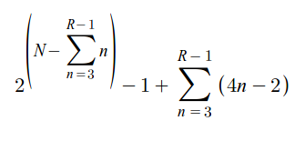

# Tower of Hanoi
An iterative C++ solution to the Tower of Hanoi puzzle using SFML to animate and display the game. The solution solves for an  unlimited amount of disks and rods. Processing time may vary depending on the ratio of disks to rods.

The objective of the game is to move the entire stack of disks to the right-most rod under these rules:
 1. Only one disk may be moved at a time
 2. A move consists of taking the upper-most disk from a stack and placing it on top of another stack
 3. No disk may be placed on top of a smaller disk
 
# Solution
Disks are numbered 1 to N in order from largest to smallest, and there are R rods.

### 3 rods
While continuously iterating from rod 1 to R until the end rod is full,
 1. Check the disk number on top of the rod
 2. If possible, move the disk left if it is an even number, or right if it is an odd number
 3. If the disk is moved, it cannot be moved again until different disk is moved.
 
The optimal number of moves is 2^N - 1.

### 4 rods and above

Assuming N > R, there will be R - 3 rods, named auxiliary rods, that store up to R - 1 disks, with each auxiliary rod storing 1 less disk than the previous. The puzzle can then be solved traditionally using the 3 rods remaining, ignoring the auxiliary rods for the time being. The disks in the auxiliary rods can then simply be transferred to the end rod.

N <= R are nearly trivial solutions.

The number of moves done in this solution is depicted below.

# Keys
 - `space` to trigger a move
 - `q` to return to title screen and quit

# Dependencies
- [SFML 2.3.2] (https://www.sfml-dev.org/)

# Screenshot

# License
This project is released under MIT License. Please review the [License file](LICENSE) for more details.
